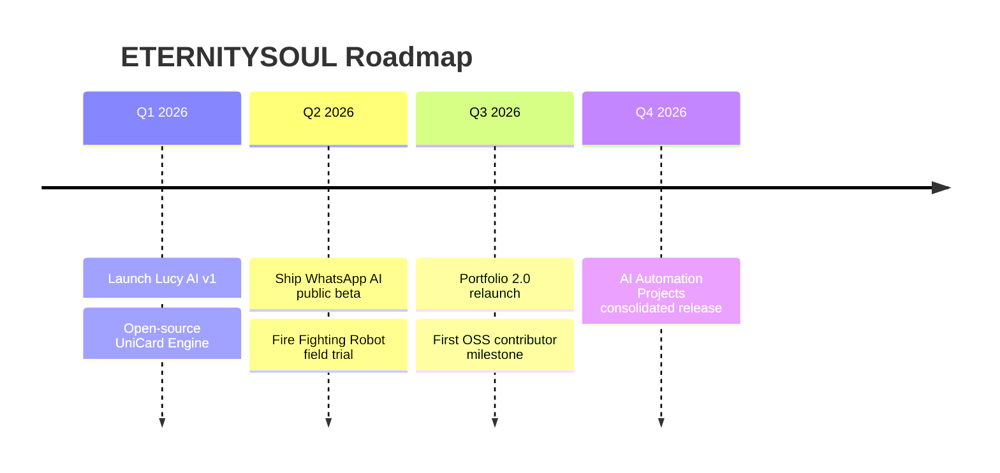

<div align="center"> 

<!-- ============ BANNER ============ -->


<!-- ============ ANIMATED TYPING HEADER ============ -->
<a href="https://github.com/EternitySoul-795">
  
</a>

<br/>

<!-- ============ SOCIAL / ACTION BUTTONS ============ -->
[](mailto:your-email@example.com)
[](https://linkedin.com/in/your-handle)
[](https://x.com/your-handle)
[](https://discord.gg/your-invite)
[](https://your-portfolio.example.com)
[](https://your-resume-link.example.com)


</div>

<div align="center"></div>

<!-- ============ INTRODUCTION ============ -->
## ⟡ Introduction

<table>
<tr>
<td width="58%" valign="middle">

<pre>
const developer = {
  name: "Khileshwar Dewangan",
  alias: "ETERNITYSOUL",
  role: ["AI Engineer", "Full-Stack Developer",
         "Automation Engineer", "Robotics Enthusiast"],
  focus: "Building intelligent, futuristic,
          human-centered software",
  location: "India",
  status: "Available for collaboration"
};
</pre>

I design and engineer software at the intersection of **artificial intelligence, automation, and clean interface design** — systems that feel effortless on the surface and are engineered with precision underneath.

</td>
<td width="42%" align="center">

</td>
</tr>
</table>

<div align="center"></div>

<!-- ============ ABOUT ============ -->
## ⟡ About Me

I'm **Khileshwar Dewangan**, building under the brand **ETERNITYSOUL** — a self-taught engineer who moves fluidly between machine learning, full-stack web development, and hardware automation. My work spans conversational AI systems, production-grade web platforms, and robotics built for real-world safety applications.

I care about **craft**: code that reads clean, interfaces that feel premium, and systems that stay reliable long after the demo is over. I'm drawn to the future of human-AI collaboration and enjoy building tools that make that future tangible today.

<br/>

<!-- ============ DEVELOPER PHILOSOPHY ============ -->
## ⟡ Developer Philosophy

> **Minimal in design. Maximal in engineering.**

- **Clarity over cleverness** — code should be obvious before it is clever.
- **Systems, not scripts** — every project is built to scale, not just to run once.
- **Design is a feature** — a good product that looks cheap is a bad product.
- **Ship, measure, refine** — iteration beats perfection on day one.
- **AI as a collaborator, not a crutch** — automate the repetitive, own the creative.

<br/>

### Mission Statement

> To engineer intelligent systems and elegant digital experiences that push the boundary between human creativity and machine intelligence — built with precision, shipped with purpose.

<br/>

<!-- ============ TECH STACK ============ -->
## ⟡ Tech Stack

**Languages**

<p>         </p>

**Frameworks & Libraries**

<p>        </p>

**AI / Machine Learning**

<p>       </p>

**Databases**

<p>      </p>

**DevOps & Cloud**

<p>       </p>

**Design Tools**

<p>     </p>

**IDEs & OS**

<p>      </p>

<div align="center"></div>

<!-- ============ DASHBOARD ============ -->
## ⟡ Dashboard

<div align="center">

<br/><sub>Custom-themed, auto-refreshing dashboard generated by <code>.github/workflows/metrics.yml</code> (lowlighter/metrics) — see <a href="./SETUP_GUIDE.md">setup guide</a> to activate.</sub>
</div>

<br/>

<!-- ============ GITHUB STATS ============ -->
## ⟡ GitHub Analytics

<div align="center">


</div>

<br/>

<!-- ============ SNAKE CONTRIBUTION ANIMATION ============ -->
## ⟡ Contribution Snake

<div align="center">
<picture>
  <source media="(prefers-color-scheme: dark)" srcset="https://raw.githubusercontent.com/EternitySoul-795/EternitySoul-795/output/github-contribution-grid-snake-dark.svg" />
  <source media="(prefers-color-scheme: light)" srcset="https://raw.githubusercontent.com/EternitySoul-795/EternitySoul-795/output/github-contribution-grid-snake.svg" />
  
</picture>

<sub>Generated automatically by <code>.github/workflows/snake.yml</code> — see <a href="./SETUP_GUIDE.md">setup guide</a> to activate.</sub>
</div>

<br/>

<!-- ============ TROPHIES ============ -->
## ⟡ Trophy Case

<div align="center">

</div>

<div align="center"></div>

<!-- ============ LIVE SIGNALS ============ -->
## ⟡ Live Signals

<table align="center">
<tr>
<td width="50%" valign="top" align="center">

**Coding Time**


<sub>Powered by WakaTime — see <a href="./SETUP_GUIDE.md">setup guide</a></sub>

</td>
<td width="50%" valign="top" align="center">

**Currently Listening**


<sub>Powered by novatorem/spotify-github-profile — see <a href="./SETUP_GUIDE.md">setup guide</a></sub>

</td>
</tr>
</table>

<div align="center"></div>

<!-- ============ FEATURED PROJECTS ============ -->
## ⟡ Featured Projects

<div align="center">

<table>
<tr>
<td width="50%" valign="top">


**Lucy AI** — Conversational AI assistant engineered for natural, low-latency dialogue and task automation.

`Python` `LLMs` `LangChain` `FastAPI`

[](https://github.com/EternitySoul-795/lucy-ai)

</td>
<td width="50%" valign="top">


**Eternity Portfolio** — Immersive 3D portfolio site blending WebGL visuals with minimal, high-contrast UI.

`Three.js` `HTML5` `CSS3` `JavaScript`

[](https://github.com/EternitySoul-795/Echo-space-3D)

</td>
</tr>
<tr>
<td width="50%" valign="top">


**UniCard Engine** — Dynamic card-generation engine for ID/profile/certificate rendering at scale.

`TypeScript` `Node.js` `Canvas API`

[](https://github.com/EternitySoul-795/unicard-engine)

</td>
<td width="50%" valign="top">


**WhatsApp AI** — Automation layer connecting LLM-driven responses to WhatsApp for smart, context-aware messaging.

`Node.js` `Baileys` `OpenAI API`

[](https://github.com/EternitySoul-795/whatsapp-ai)

</td>
</tr>
<tr>
<td width="50%" valign="top">


**Fire Fighting Robot** — Autonomous, sensor-driven robotics platform for early fire detection and suppression, part of [AI-for-Public-Safety](https://github.com/EternitySoul-795/AI-for-Public-Safety).

`C++` `Embedded Systems` `Sensors`

[](https://github.com/EternitySoul-795/AI-for-Public-Safety)

</td>
<td width="50%" valign="top">


**AI Automation Projects** — A growing collection of applied machine-learning and automation experiments.

`Python` `PyTorch` `OpenCV`

[](https://github.com/EternitySoul-795/ai-automation-projects)

</td>
</tr>
</table>

</div>

<sub>Repo links follow the kebab-case naming convention in <a href="./templates/repo-readme-template.md">templates/</a> — create/rename repos to match, or edit the links directly. See <a href="./SETUP_GUIDE.md">SETUP_GUIDE.md</a>.</sub>

<div align="center"></div>

<br/>

<!-- ============ EXPERIENCE ============ -->
## ⟡ Experience

```
2025 — Present   Independent AI & Full-Stack Developer — ETERNITYSOUL
                 Designing AI-driven products, automation tools, and public-safety robotics.

20XX — 20XX      <Role> @ <Company / Program>
                 <One-line impact statement — replace with real experience.>
```

<sub>Replace timeline entries with verified roles, internships, or programs.</sub>

<br/>

<!-- ============ ACHIEVEMENTS ============ -->
## ⟡ Achievements

[](https://github.com/EternitySoul-795?tab=achievements)

- Shipped `<N>` production projects across AI, web, and robotics
- `<Hackathon / competition name>` — `<placement, year>`
- Active open-source contributor — see [Open Source](#-open-source)

<sub>GitHub's native achievement badges (Pull Shark, Galaxy Brain, etc.) aren't embeddable via API — linked above instead of faked.</sub>

<br/>

<!-- ============ CERTIFICATIONS ============ -->
## ⟡ Certifications

<p>


</p>

<sub>Add real certifications (Coursera, Google, AWS, etc.) as badges linking to credential URLs.</sub>

<br/>

<!-- ============ CURRENT FOCUS ============ -->
## ⟡ Current Focus

- Building **Lucy AI** — a next-gen conversational assistant
- Refining autonomous behavior for the **Fire Fighting Robot** platform
- Exploring agentic workflows and multi-model orchestration

### Currently Learning

<p>    </p>

<br/>

<!-- ============ ROADMAP ============ -->
## ⟡ Roadmap



<br/>

### Goals for 2026

- [ ] Ship **Lucy AI v1** to public users
- [ ] Field-test the **Fire Fighting Robot** in a real safety scenario
- [ ] Publish **3+** meaningful open-source contributions
- [ ] Relaunch portfolio with full case studies
- [ ] Reach `<N>` GitHub followers / `<N>` stars across projects

<br/>

<!-- ============ OPEN SOURCE ============ -->
## ⟡ Open Source

I contribute to and maintain open-source tools around AI tooling, automation, and developer experience. Check [pinned repositories](https://github.com/EternitySoul-795?tab=repositories) for active work — PRs and issues welcome.

<div align="center"></div>

<!-- ============ CONTACT ============ -->
## ⟡ Contact

<div align="center">

| Channel | Link |
|---|---|
| Email | [your-email@example.com](mailto:your-email@example.com) |
| LinkedIn | [linkedin.com/in/your-handle](https://linkedin.com/in/your-handle) |
| X / Twitter | [@your-handle](https://x.com/your-handle) |
| Discord | [Join server](https://discord.gg/your-invite) |
| Portfolio | [your-portfolio.example.com](https://your-portfolio.example.com) |
| Resume | [View Resume](https://your-resume-link.example.com) |

</div>

<br/>

<!-- ============ QUOTE ============ -->
## ⟡ Quote

<div align="center">

<!--QUOTE:START-->
> *"An intelligent person hires people who are more intelligent than he is."* — Robert Kiyosaki
<!--QUOTE:END-->

<sub>Auto-refreshed by <code>.github/workflows/dynamic-quote.yml</code></sub>

</div>

<br/>

<!-- ============ FOOTER ============ -->
<div align="center">


<sub>© 2026 Khileshwar Dewangan · ETERNITYSOUL — Designed with precision, built for the future.</sub>
</div>
